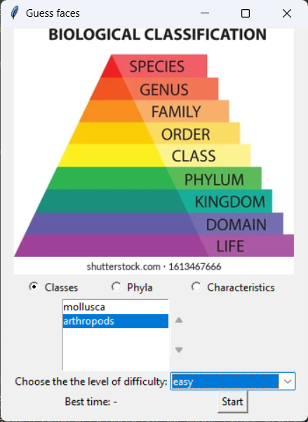
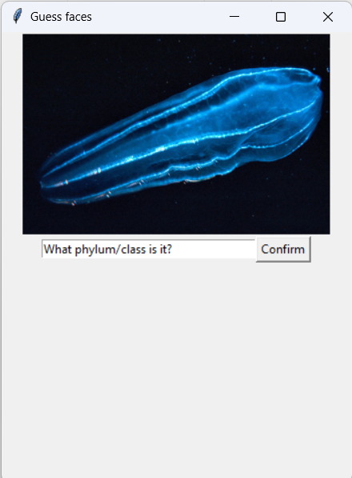
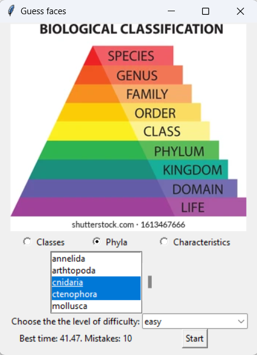

# Taxonomy game
The purpose of Taxonomy Game is to enhance the learning of biological classification for biology students.

  

## Features
With Taxonomy Game, students can test their knowledge on:
- classifying species to their corresponding phyla (10 at the moment)
- determining phyla based on given characteristics (10 at the moment)
- classifying species to their corresponding classes

Other features:
- various difficulty levels: easy (20s per answer), moderate (15s per answer), and hard (10s per answer)
- storing the best result so far
- printing the number of mistakes

## Getting started
There are two ways to use the game:
1. With .exe file
   1. clone the repository
   2. run the guessing_phyla_classes.exe
2. Without .exe file
   1. pip-install Pillow library
   2. clone the repository
   3. run the guessing_phyla_classes.py

## Note!
Database is currently unavailable. In the near future it'll be transferred into json file and an appropriate script
will be added to transfer json data to sqlite database (GitHub sets the limit of max file size).
